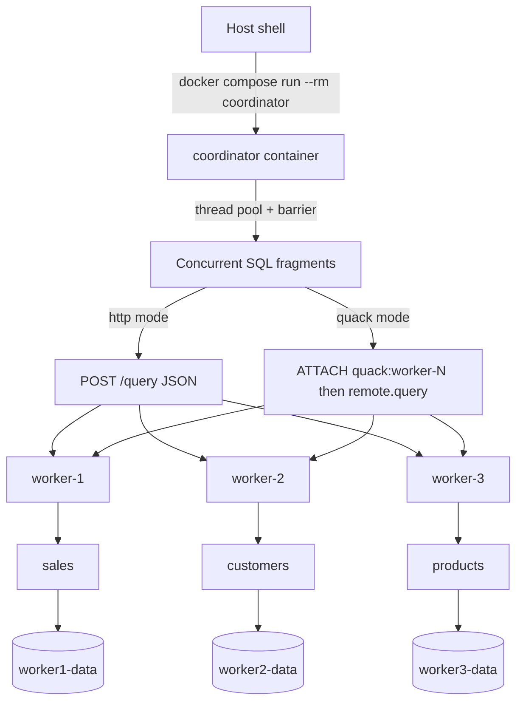

# DuckDB Local Quack Cluster (Docker)

A local, dependency-free reproduction of the "Quack pattern": **three independent DuckDB
servers**, each owning one table, plus a **coordinator** that fires SQL fragments at all of
them concurrently and collects the results.

Everything runs in Docker Compose on your machine. No AWS, no SSM Parameter Store, no Lambda
token manager.

> This is **not** distributed query processing. There is no cross-worker planner, no shuffling
> and no distributed joins. The coordinator runs *independent* SQL statements against separate
> DuckDB servers in parallel and gathers the results — exactly like the original article.

For the extended, copy-paste-heavy version of these steps (including the 10-million-row
variants and the full expected output dumps), see [`run-book.md`](run-book.md). To drive the
cluster from Python on your **host** instead of from inside the coordinator container, see
[`run-book-from-local.md`](run-book-from-local.md).

---

## Table of contents

1. [Architecture](#architecture)
2. [Repository layout](#repository-layout)
3. [Data model](#data-model)
4. [The two server modes](#the-two-server-modes)
5. [Configuration reference](#configuration-reference)
6. [Prerequisites](#prerequisites)
7. [Runbook A — HTTP mode](#runbook-a--http-mode)
8. [Runbook B — Quack mode](#runbook-b--quack-mode)
9. [Coordinator CLI reference](#coordinator-cli-reference)
10. [Running clients from the host](#running-clients-from-the-host)
11. [Common operations](#common-operations)
12. [Troubleshooting](#troubleshooting)

---

## Architecture



Each worker owns a **separate DuckDB database file** on a **separate named volume**, so the
three servers never contend for the same file lock.

### Published ports

| Service      | Container port | Host port | Contents  |
| ------------ | -------------- | --------- | --------- |
| `worker-1`   | 9494           | **9491**  | `sales`   |
| `worker-2`   | 9494           | **9492**  | `customers` |
| `worker-3`   | 9494           | **9493**  | `products` |
| `coordinator`| —              | —         | no server, runs and exits |

Inside the compose network the coordinator always reaches workers at `worker-N:9494`. The host
port mappings (9491–9493) exist so you can `curl` a worker directly from your laptop.

---

## Repository layout

```
.
├── Dockerfile                     # python:3.12-slim + duckdb==1.5.5
├── docker-compose.yml             # worker-1..3, coordinator, 3 named volumes
├── requirements.txt               # duckdb==1.5.5
├── .env                           # SERVER_MODE, QUACK_TOKEN, ROW_COUNT, ...
├── run-book.md                    # extended version of this runbook
├── run-book-from-local.md         # runbook for host-side Python clients
├── scripts/
│   └── entrypoint-worker.sh       # seed-on-first-boot, then exec the right server
├── app/
│   ├── seed_related_data.py       # deterministic hash-based seed data
│   ├── http_sql_server.py         # SERVER_MODE=http  -> tiny JSON SQL server
│   ├── quack_server.py            # SERVER_MODE=quack -> real Quack server
│   ├── related_cluster_sql.py     # the coordinator CLI (both modes)
│   └── quack_pattern_demo.py      # fixed 3-fragment demo that prints the ATTACH pattern
└── local/                         # host-side clients (run outside Docker)
    ├── http_client.py             # stdlib-only client for SERVER_MODE=http
    ├── quack_client.py            # DuckDB/Quack client for SERVER_MODE=quack
    ├── requirements.txt           # duckdb==1.5.5, needed for Quack mode only
    ├── .env.local                 # sourceable WORKER_N_ENDPOINT exports
    └── README.md
```

### Startup flow

`scripts/entrypoint-worker.sh` runs on every worker boot:

1. Requires `WORKER_INDEX` (set per service in `docker-compose.yml`).
2. If `/data/worker.duckdb.seeded` is missing — or `FORCE_SEED=1` — it runs
   `seed_related_data.py --worker N --rows $ROW_COUNT --database $DUCKDB_FILE`, then writes the
   marker file so subsequent restarts skip seeding.
3. Execs `app/quack_server.py` when `SERVER_MODE=quack`, otherwise `app/http_sql_server.py`.

Because the seed marker lives on the named volume, **data survives `docker compose down`** and
is only reset by `docker compose down -v`.

---

## Data model

Seeding is deterministic (`hash(i)` over `range(1, ROW_COUNT + 1)`), so every worker produces
the same data on every machine.

| Worker   | Table       | Columns |
| -------- | ----------- | ------- |
| worker-1 | `sales`     | `sale_id`, `customer_id`, `product_id`, `quantity`, `sales_channel`, `payment_method`, `sale_status`, `sale_date`, `sold_unit_price`, `discount_pct` |
| worker-2 | `customers` | `customer_id`, `customer_code`, `country`, `segment`, `membership_tier`, `is_active`, `joined_date`, `last_seen_at`, `credit_limit` |
| worker-3 | `products`  | `product_id`, `sku`, `category`, `brand`, `supplier_region`, `catalogue_price`, `stock_quantity`, `discontinued`, `introduced_date` |

Note that `sales.customer_id` / `sales.product_id` are random hashes, **not** foreign keys into
the other workers. There is no referential integrity across the cluster — by design, since
cross-worker joins are out of scope.

---

## The two server modes

`SERVER_MODE` selects how a worker exposes its database, and how the coordinator talks to it.

| | `http` (default) | `quack` |
| --- | --- | --- |
| Worker process | `app/http_sql_server.py` | `app/quack_server.py` |
| Transport | Plain HTTP + JSON, Python stdlib | DuckDB **Quack** extension over HTTP |
| Server entry point | `ThreadingHTTPServer.serve_forever()` | `CALL quack_serve('quack:0.0.0.0:9494', allow_other_hostname => true, token => '...')` |
| Coordinator client | `POST /query` with `{"sql": ..., "allow_write": ...}` | `ATTACH 'quack:worker-N:9494' AS remote (TYPE quack, TOKEN '...', DISABLE_SSL true)` then `SELECT * FROM remote.query('...')` |
| Auth | `X-Quack-Token` header or `Authorization: Bearer` | Quack token (min. 4 characters) |
| Read path | Opens the DB file `read_only=True` | Full remote catalog, transactions forwarded |
| Write path | Serialised behind a process-wide `RLock` | Native DuckDB concurrency |
| Health probe used by coordinator | `GET /health` | `SELECT 1 AS ok` over `ATTACH` |
| Extra requirements | none | outbound internet on first `INSTALL quack` |

Both modes use the **same coordinator script and the same CLI flags**, so every test below is
runnable in either mode by adding `--mode quack`.

### Why `allow_other_hostname => true` is required

Quack refuses to bind a non-local hostname by default. Inside Docker the worker must listen on
`0.0.0.0` to be reachable from the coordinator container, so `app/quack_server.py` always passes
`allow_other_hostname => true`. In production you would front this with a TLS-terminating
reverse proxy — see the [Quack security docs](https://duckdb.org/docs/current/quack/security).

---

## Configuration reference

All variables are read from `.env` (or your shell environment) by `docker compose`.

| Variable | Default | Applies to | Purpose |
| --- | --- | --- | --- |
| `SERVER_MODE` | `http` | workers, coordinator | `http` or `quack` |
| `ROW_COUNT` | `100000` | workers | Rows per seeded table |
| `QUACK_PORT` | `9494` | all | Listen port inside the container |
| `QUACK_TOKEN` | `local-dev-token` | all | Shared auth token |
| `QUACK_HOST` | `0.0.0.0` | `quack_server.py` | Bind address for `quack_serve` |
| `DUCKDB_FILE` | `/data/worker.duckdb` | workers | Database path on the volume |
| `FORCE_SEED` | `0` | workers | Set to `1` to re-seed even if the marker exists |
| `WORKER_INDEX` | per service | workers | `1`, `2` or `3`; selects the table to seed |
| `WORKER_1_ENDPOINT` | `worker-1:9494` | coordinator | Override worker-1 address |
| `WORKER_2_ENDPOINT` | `worker-2:9494` | coordinator | Override worker-2 address |
| `WORKER_3_ENDPOINT` | `worker-3:9494` | coordinator | Override worker-3 address |

A minimal `.env`:

```dotenv
SERVER_MODE=http
QUACK_TOKEN=local-dev-token
ROW_COUNT=100000
```

> Changing `.env` does **not** affect already-running containers. Always follow an edit with
> `docker compose up -d worker-1 worker-2 worker-3`, which recreates them.

---

## Prerequisites

- Docker Engine with the Compose plugin (`docker compose version`)
- Ports `9491`, `9492`, `9493` free on the host
- For Quack mode only: outbound internet access from the containers (the extension is
  downloaded by `INSTALL quack` at container start)

Sanity check:

```bash
docker compose version
docker compose config --services
```

Expected: the four service names `worker-1`, `worker-2`, `worker-3` and `coordinator`.

---

## Runbook A — HTTP mode

Run these steps in order. Each step has a verification and the output you should expect.

### A0. Select the mode

```bash
# .env
SERVER_MODE=http
```

Verify:

```bash
docker compose config | grep SERVER_MODE
```

Expected:

```text
SERVER_MODE: http
```

### A1. Build the image

```bash
docker compose build
```

Verify: the build ends with `FINISHED` and no error. All four services share one image, so this
only builds once.

### A2. Start the workers

```bash
docker compose up -d worker-1 worker-2 worker-3
```

Verify they are `Up` and **not** `Restarting`:

```bash
docker compose ps
```

### A3. Confirm seeding and server start

```bash
docker compose logs -f worker-1
```

Expected on first boot:

```text
Seeding worker 1 with 100000 rows into /data/worker.duckdb
Seeding worker 1 table 'sales' with 100000 rows into /data/worker.duckdb
Created sales with 100000 rows
Starting local HTTP SQL server mode
HTTP SQL server listening on 0.0.0.0:9494, db=/data/worker.duckdb
```

On later boots the seeding lines are skipped (the `.seeded` marker exists). Repeat for
`worker-2` (`customers`) and `worker-3` (`products`).

### A4. Health-check each worker from the host

```bash
curl -s localhost:9491/health
curl -s localhost:9492/health
curl -s localhost:9493/health
```

Expected (per worker):

```json
{"status": "ok", "db": "/data/worker.duckdb"}
```

### A5. Query a worker directly (bypassing the coordinator)

```bash
curl -s -X POST localhost:9491/query \
  -H 'Content-Type: application/json' \
  -H 'X-Quack-Token: local-dev-token' \
  -d '{"sql": "SELECT COUNT(*) AS n FROM sales", "allow_write": false}'
```

Expected:

```json
{"columns": ["n"], "rows": [[100000]]}
```

A missing or wrong token returns `401 {"error": "invalid or missing token"}`.

### A6. Concurrent fan-out across all three workers

This is the core test: three fragments start together behind a barrier.

```bash
docker compose run --rm coordinator \
  --query "worker-1=SELECT sale_status, COUNT(*) AS count_star FROM sales GROUP BY sale_status ORDER BY sale_status" \
  --query "worker-2=SELECT country, COUNT(*) AS count_star FROM customers GROUP BY country ORDER BY country" \
  --query "worker-3=SELECT category, COUNT(*) AS count_star FROM products GROUP BY category ORDER BY category"
```

Expected shape:

```text
Waiting for worker-1 at worker-1:9494 ...
Waiting for worker-2 at worker-2:9494 ...
Waiting for worker-3 at worker-3:9494 ...

Concurrent remote queries
worker     table      start_offset_ms duration_seconds
---------- ---------- --------------- ------------------
worker-3   query-3              0.976              0.442
worker-1   query-1              1.123              0.431
worker-2   query-2              1.325              0.455

Start spread: 0.349 ms

query-1 (worker-1)
sale_status  count_star
-----------  ----------
cancelled         19...
...
```

**What proves concurrency:** `Start spread` is sub-millisecond to a few milliseconds — all three
fragments left the coordinator at effectively the same instant, and their durations overlap.

### A7. Heavier concurrent analytics

```bash
docker compose run --rm coordinator \
  --query "worker-1=WITH daily AS (SELECT sale_date, sales_channel, sale_status, COUNT(*) AS transaction_count, SUM(quantity) AS units, SUM(quantity * sold_unit_price) AS revenue FROM sales GROUP BY ALL) SELECT * FROM daily ORDER BY revenue DESC LIMIT 20" \
  --query "worker-2=WITH customer_groups AS (SELECT country, segment, membership_tier, COUNT(*) AS customer_count, AVG(credit_limit) AS average_credit_limit FROM customers GROUP BY ALL) SELECT * FROM customer_groups ORDER BY customer_count DESC LIMIT 20" \
  --query "worker-3=WITH inventory_groups AS (SELECT category, brand, supplier_region, COUNT(*) AS product_count, SUM(stock_quantity) AS stock_units, SUM(stock_quantity * catalogue_price) AS inventory_value FROM products GROUP BY ALL) SELECT * FROM inventory_groups ORDER BY inventory_value DESC LIMIT 20"
```

Verify: three result tables print, and `duration_seconds` is meaningfully larger than in A6.

### A8. Concurrent writes and reads

Writes need `--allow-write`; without it the coordinator opens the database read-only and any
`INSERT`/`DELETE`/DDL fails.

Clear the target range first:

```bash
docker compose run --rm coordinator \
  --allow-write \
  --query "worker-1=DELETE FROM sales WHERE sale_id BETWEEN 30000001 AND 30000020"
```

Then fire 5 inserts and 3 reads at worker-1 simultaneously:

```bash
docker compose run --rm coordinator \
  --show-sql \
  --allow-write \
  --query "worker-1=INSERT INTO sales (sale_id, customer_id, product_id, quantity, sales_channel, payment_method, sale_status, sale_date, sold_unit_price, discount_pct) VALUES (30000001, 1, 1, 1, 'online', 'card', 'completed', DATE '2026-09-24', 10.00, 0.00)" \
  --query "worker-1=INSERT INTO sales (sale_id, customer_id, product_id, quantity, sales_channel, payment_method, sale_status, sale_date, sold_unit_price, discount_pct) VALUES (30000002, 2, 2, 2, 'store', 'bank_transfer', 'processing', DATE '2026-09-24', 20.00, 0.00)" \
  --query "worker-1=INSERT INTO sales (sale_id, customer_id, product_id, quantity, sales_channel, payment_method, sale_status, sale_date, sold_unit_price, discount_pct) VALUES (30000003, 3, 3, 3, 'marketplace', 'wallet', 'shipped', DATE '2026-09-24', 30.00, 0.00)" \
  --query "worker-1=INSERT INTO sales (sale_id, customer_id, product_id, quantity, sales_channel, payment_method, sale_status, sale_date, sold_unit_price, discount_pct) VALUES (30000004, 4, 4, 4, 'telephone', 'invoice', 'returned', DATE '2026-09-24', 40.00, 0.00)" \
  --query "worker-1=INSERT INTO sales (sale_id, customer_id, product_id, quantity, sales_channel, payment_method, sale_status, sale_date, sold_unit_price, discount_pct) VALUES (30000005, 5, 5, 5, 'online', 'card', 'cancelled', DATE '2026-09-24', 50.00, 0.00)" \
  --query "worker-1=SELECT COUNT(*) AS visible_rows FROM sales WHERE sale_id BETWEEN 30000001 AND 30000020" \
  --query "worker-1=SELECT COUNT(*) AS visible_rows FROM sales WHERE sale_id BETWEEN 30000001 AND 30000020" \
  --query "worker-1=SELECT COUNT(*) AS visible_rows FROM sales WHERE sale_id BETWEEN 30000001 AND 30000020"
```

Verify: no fragment reports `ERROR`, and the three `visible_rows` reads return between `0` and
`5` — the exact value depends on interleaving, which *is* the point of the test. In HTTP mode
writes are serialised by a lock, so reads never see a torn row.

### A9. Concurrent DDL

```bash
docker compose run --rm coordinator \
  --allow-write \
  --query "worker-1=CREATE OR REPLACE TABLE sales_agg AS SELECT sale_status, COUNT(*) AS sale_count FROM sales GROUP BY sale_status" \
  --query "worker-2=CREATE OR REPLACE TABLE customers_agg AS SELECT country, COUNT(*) AS customer_count FROM customers GROUP BY country" \
  --query "worker-3=CREATE OR REPLACE TABLE products_agg AS SELECT category, COUNT(*) AS product_count FROM products GROUP BY category"
```

Then read the new tables back concurrently:

```bash
docker compose run --rm coordinator \
  --query "worker-1=SELECT * FROM sales_agg ORDER BY sale_count DESC" \
  --query "worker-2=SELECT * FROM customers_agg ORDER BY customer_count DESC" \
  --query "worker-3=SELECT * FROM products_agg ORDER BY product_count DESC"
```

Verify: each worker returns its own aggregate table, proving DDL ran on three separate
databases at the same time.

### A10. Tear down

```bash
docker compose down        # keep the seeded volumes
docker compose down -v     # delete the data too; next boot re-seeds
```

---

## Runbook B — Quack mode

Same tests, but the workers run the real DuckDB **Quack** server and the coordinator attaches
to them as a remote catalog.

### B0. Select the mode

```bash
# .env
SERVER_MODE=quack
```

Verify:

```bash
docker compose config | grep SERVER_MODE
```

Expected:

```text
SERVER_MODE: quack
```

### B1. Recreate the workers

```bash
docker compose down
docker compose up -d --build worker-1 worker-2 worker-3
```

Add `--build` whenever you have changed anything under `app/` — the code is baked into the
image at build time, so editing a file on the host has no effect until you rebuild.

Verify:

```bash
docker compose ps
```

All three workers must be `Up`. If they show `Restarting`, jump to
[Troubleshooting](#troubleshooting).

### B2. Confirm the Quack server started

```bash
docker compose logs -f worker-1
```

Expected:

```text
Starting Quack server mode
Starting Quack server on quack:0.0.0.0:9494, db=/data/worker.duckdb
  uri: quack:0.0.0.0:9494
  url: http://0.0.0.0:9494
  auth_token: <redacted, set in QUACK_TOKEN>
```

`quack_serve` returns the listen URI, the HTTP URL and the effective auth token; the script
prints each returned column, redacting the token when you supplied one yourself. Exact column
names can vary between Quack builds.

`quack_serve` starts its listener on a background thread and returns immediately; the script
then sleeps forever to keep the container alive. Repeat for `worker-2` and `worker-3`.

### B3. Run the Quack pattern demo

This is the clearest proof of the pattern — the script prints the exact coordinator-side SQL it
executes.

```bash
docker compose run --rm \
  --entrypoint python \
  coordinator \
  /app/quack_pattern_demo.py
```

Expected:

```text
[query-1] worker-1: ATTACH 'quack:worker-1:9494' AS remote (TYPE quack, TOKEN 'REDACTED', DISABLE_SSL true)
[query-2] worker-2: ATTACH 'quack:worker-2:9494' AS remote (TYPE quack, TOKEN 'REDACTED', DISABLE_SSL true)
[query-3] worker-3: ATTACH 'quack:worker-3:9494' AS remote (TYPE quack, TOKEN 'REDACTED', DISABLE_SSL true)

Concurrent remote queries using Quack article pattern
worker     table      start_offset_ms duration_seconds
---------- ---------- --------------- ------------------
worker-3   query-3              0.948              0.531
worker-1   query-1              1.133              0.542
worker-2   query-2              1.257              0.551

Start spread: 0.309 ms

query-1 (worker-1)
Coordinator-side Quack pattern:
ATTACH 'quack:worker-1:9494' AS remote (TYPE quack, TOKEN 'REDACTED', DISABLE_SSL true)
SELECT * FROM remote.query('SELECT sale_status, COUNT(*) AS count_star FROM sales GROUP BY sale_status ORDER BY sale_status')
Result:
sale_status  count_star
-----------  ----------
cancelled         19...
```

**What proves this is the Quack pattern:**

- a real `ATTACH 'quack:...'` against a remote DuckDB catalog, not a hand-rolled HTTP call
- the SQL is pushed down and executed remotely via `remote.query(...)`
- the token is never printed (`REDACTED`)
- all three attachments happen concurrently behind a barrier

### B4. Connectivity smoke test through the coordinator

```bash
docker compose run --rm coordinator \
  --mode quack \
  --wait-timeout 900 \
  --query "worker-1=SELECT 1 AS worker_1_ok" \
  --query "worker-2=SELECT 2 AS worker_2_ok" \
  --query "worker-3=SELECT 3 AS worker_3_ok"
```

Expected: three one-row results (`1`, `2`, `3`) and a small `Start spread`.

> `--mode quack` is optional here — the coordinator defaults to `$SERVER_MODE` — but stating it
> explicitly keeps the command correct even if `.env` drifts.

### B5. Concurrent analytics in Quack mode

```bash
docker compose run --rm coordinator \
  --mode quack \
  --wait-timeout 900 \
  --show-sql \
  --query "worker-1=SELECT sale_status, COUNT(*) AS count_star FROM sales GROUP BY sale_status ORDER BY sale_status" \
  --query "worker-2=SELECT country, COUNT(*) AS count_star FROM customers GROUP BY country ORDER BY country" \
  --query "worker-3=SELECT category, COUNT(*) AS count_star FROM products GROUP BY category ORDER BY category"
```

Verify: the result sets match what A6 produced in HTTP mode. Same data, same SQL, different
transport.

### B6. Concurrent writes and reads in Quack mode

```bash
docker compose run --rm coordinator \
  --mode quack \
  --allow-write \
  --wait-timeout 900 \
  --query "worker-1=DELETE FROM sales WHERE sale_id BETWEEN 40000001 AND 40000005"
```

```bash
docker compose run --rm coordinator \
  --mode quack \
  --allow-write \
  --show-sql \
  --wait-timeout 900 \
  --query "worker-1=INSERT INTO sales (sale_id, customer_id, product_id, quantity, sales_channel, payment_method, sale_status, sale_date, sold_unit_price, discount_pct) VALUES (40000001, 1, 1, 1, 'online', 'card', 'completed', DATE '2026-09-24', 10.00, 0.00)" \
  --query "worker-1=INSERT INTO sales (sale_id, customer_id, product_id, quantity, sales_channel, payment_method, sale_status, sale_date, sold_unit_price, discount_pct) VALUES (40000002, 2, 2, 2, 'store', 'bank_transfer', 'processing', DATE '2026-09-24', 20.00, 0.00)" \
  --query "worker-1=INSERT INTO sales (sale_id, customer_id, product_id, quantity, sales_channel, payment_method, sale_status, sale_date, sold_unit_price, discount_pct) VALUES (40000003, 3, 3, 3, 'marketplace', 'wallet', 'shipped', DATE '2026-09-24', 30.00, 0.00)" \
  --query "worker-1=INSERT INTO sales (sale_id, customer_id, product_id, quantity, sales_channel, payment_method, sale_status, sale_date, sold_unit_price, discount_pct) VALUES (40000004, 4, 4, 4, 'telephone', 'invoice', 'returned', DATE '2026-09-24', 40.00, 0.00)" \
  --query "worker-1=INSERT INTO sales (sale_id, customer_id, product_id, quantity, sales_channel, payment_method, sale_status, sale_date, sold_unit_price, discount_pct) VALUES (40000005, 5, 5, 5, 'online', 'card', 'cancelled', DATE '2026-09-24', 50.00, 0.00)" \
  --query "worker-1=SELECT COUNT(*) AS visible_rows FROM sales WHERE sale_id BETWEEN 40000001 AND 40000005"
```

Verify: no `ERROR` lines. Unlike HTTP mode, Quack writes go through DuckDB's own MVCC rather
than a Python lock, so interleaving is handled by the engine.

### B7. Concurrent DDL in Quack mode

```bash
docker compose run --rm coordinator \
  --mode quack \
  --allow-write \
  --wait-timeout 900 \
  --query "worker-1=CREATE OR REPLACE TABLE sales_agg AS SELECT sale_status, COUNT(*) AS sale_count FROM sales GROUP BY sale_status" \
  --query "worker-2=CREATE OR REPLACE TABLE customers_agg AS SELECT country, COUNT(*) AS customer_count FROM customers GROUP BY country" \
  --query "worker-3=CREATE OR REPLACE TABLE products_agg AS SELECT category, COUNT(*) AS product_count FROM products GROUP BY category"
```

```bash
docker compose run --rm coordinator \
  --mode quack \
  --wait-timeout 900 \
  --query "worker-1=SELECT * FROM sales_agg ORDER BY sale_count DESC" \
  --query "worker-2=SELECT * FROM customers_agg ORDER BY customer_count DESC" \
  --query "worker-3=SELECT * FROM products_agg ORDER BY product_count DESC"
```

### B8. Tear down

```bash
docker compose down        # keep the seeded volumes
docker compose down -v     # delete the data too
```

---

## Coordinator CLI reference

`app/related_cluster_sql.py` is the coordinator. In compose it is the `coordinator` service's
entrypoint, so arguments pass straight through `docker compose run --rm coordinator ...`.

| Flag | Default | Description |
| --- | --- | --- |
| `--query "worker-N=SQL"` | — | Repeatable. Inline SQL fragment pinned to a worker. |
| `--query-file "worker-N=/path.sql"` | — | Repeatable. Read the fragment from a file inside the container. |
| `--allow-write` | off | Permit `INSERT`, `UPDATE`, `DELETE` and DDL. |
| `--show-sql` | off | Echo each fragment's SQL above its result. |
| `--mode {http,quack}` | `$SERVER_MODE` or `http` | Transport used to reach the workers. |
| `--wait-timeout` | `180` | Seconds to wait for workers before giving up. |
| `--max-rows` | `100` | Rows printed per result before truncating. |

Worker labels must look like `worker-1`, `worker-2`, `worker-3`. Each label resolves to
`$WORKER_N_ENDPOINT`, falling back to `worker-N:$QUACK_PORT`.

The coordinator waits for every referenced worker to become reachable, then releases all
fragments at once through a `threading.Barrier` and reports each fragment's
`start_offset_ms` and `duration_ms` relative to a shared epoch.

### Using SQL files instead of inline SQL

Mount a host directory into the coordinator:

```yaml
  coordinator:
    volumes:
      - ./queries:/queries:ro
```

Then reference the files by their in-container path:

```bash
docker compose run --rm coordinator \
  --query-file "worker-1=/queries/sales.sql" \
  --query-file "worker-2=/queries/customers.sql" \
  --query-file "worker-3=/queries/products.sql"
```

---

## Running clients from the host

You do not have to go through the coordinator container. Both worker protocols are published to
`localhost`, so Python on your Linux host can talk to the cluster directly.

The full step-by-step sequence is in [`run-book-from-local.md`](run-book-from-local.md); the
client scripts live in [`local/`](local/README.md).

| Script | Mode | Host dependencies |
| --- | --- | --- |
| `local/http_client.py` | `SERVER_MODE=http` | none — standard library only |
| `local/quack_client.py` | `SERVER_MODE=quack` | `duckdb==1.5.5`, must match the image |

**The workers choose the protocol, not your script.** Only one server process runs per
container, so in Quack mode there is no `/health` or `/query` endpoint, and in HTTP mode there
is no Quack listener. Check with `docker compose config | grep SERVER_MODE` first.

Point host-side scripts at the published ports by sourcing the shared exports:

```bash
source local/.env.local
```

That sets `QUACK_TOKEN` plus `WORKER_1_ENDPOINT=localhost:9491`, `WORKER_2_ENDPOINT=localhost:9492`
and `WORKER_3_ENDPOINT=localhost:9493`. These are the same variable names the in-container
coordinator reads, so one set of exports works for `local/*.py` **and** for running
`app/related_cluster_sql.py` or `app/quack_pattern_demo.py` directly on the host.

### HTTP mode from the host

```bash
python local/http_client.py --health
python local/http_client.py --query "worker-1=SELECT COUNT(*) AS n FROM sales"
python local/http_client.py --allow-write --query "worker-1=DELETE FROM sales WHERE sale_id = 1"
```

### Quack mode from the host

```bash
python -m venv .venv && . .venv/bin/activate
pip install -r local/requirements.txt

python local/quack_client.py --check
python local/quack_client.py --query "worker-1=SELECT COUNT(*) AS n FROM sales"
python local/quack_client.py --attach-all --tables
python local/quack_client.py --attach-all --sql "SELECT sale_status, COUNT(*) FROM w1.sales GROUP BY 1"
```

Quack mode is the more capable of the two: `ATTACH` gives you a real remote catalog, so
`w1.sales` behaves like a local table and transactions are forwarded to the server. HTTP mode is
a stateless JSON RPC by comparison.

Both scripts are importable:

```python
import sys

sys.path.insert(0, "local")

from http_client import HttpClient      # or: from quack_client import QuackClient

print(HttpClient("worker-1").query("SELECT COUNT(*) FROM sales"))
```

### Do not open the database files directly

The data lives in Docker **named** volumes, which on Docker Desktop / WSL sit inside the VM
rather than at a usable host path. In Quack mode `quack_server.py` also holds a persistent
read-write connection, so a second process opening the same file gets a lock conflict. Always go
through the published ports.

---

## Common operations

### Re-seed with more rows

```bash
docker compose down -v
ROW_COUNT=10000000 docker compose up -d worker-1 worker-2 worker-3
```

10 million rows per table is the size used in the original article. Seeding is one-shot per
volume, so watch `docker compose logs -f worker-1` until you see `Created sales with 10000000 rows`.

### Force a re-seed without deleting the volume

```bash
FORCE_SEED=1 docker compose up -d worker-1 worker-2 worker-3
```

### Inspect a worker's database directly

```bash
docker compose exec worker-1 python -c "import duckdb; print(duckdb.connect('/data/worker.duckdb', read_only=True).execute('SELECT COUNT(*) FROM sales').fetchone())"
```

This only works while no other process holds the file open. In **Quack mode** `quack_server.py`
keeps a persistent connection, so a second process will fail with a lock conflict — query
through the coordinator instead. In HTTP mode the server opens and closes a connection per
request, so the file is normally free.

### Check which mode is active

```bash
docker compose config | grep SERVER_MODE
docker compose logs worker-1 | grep -E "HTTP SQL server|Quack server"
```

### Apply code changes

```bash
docker compose up -d --build worker-1 worker-2 worker-3
```

The `app/` directory is copied into the image at build time — there is no bind mount, so a
rebuild is mandatory after any code edit.

---

## Troubleshooting

### Workers stuck in `Restarting`

```bash
docker compose ps
docker compose logs --tail 50 worker-1
```

A crash loop almost always means the worker process raised on startup. Read the last traceback.

### `Catalog Error: Table Function with name serve does not exist!`

The script is calling a Quack function your DuckDB build does not provide. Since DuckDB v1.5.3
the server entry point is the `quack_serve` table function, and it takes a `quack:` URI rather
than a database path:

```sql
CALL quack_serve('quack:0.0.0.0:9494', allow_other_hostname => true, token => 'local-dev-token');
```

`allow_other_hostname => true` is required under Docker: by default Quack refuses to bind
anything other than a local hostname, so the workers would be unreachable from the coordinator.

To list what your build actually exposes:

```sql
SELECT DISTINCT function_name
FROM duckdb_functions()
WHERE function_name ILIKE '%quack%'
ORDER BY 1;
```

### `INSTALL quack` fails or hangs

The extension is downloaded at container start, so Quack mode needs outbound internet. If you
are behind a proxy, export `HTTP_PROXY`/`HTTPS_PROXY` for the worker services. HTTP mode has no
such dependency.

### Coordinator prints `Timed out waiting for worker-N`

- Confirm the worker is `Up`, not `Restarting`.
- Confirm `SERVER_MODE` matches the `--mode` you passed.
- Confirm `QUACK_TOKEN` is identical in `.env` for workers and coordinator, and at least 4
  characters long (Quack rejects shorter tokens).
- Raise the timeout: `--wait-timeout 1800`.

### Quack mode: client tries HTTPS and fails

Workers serve plain HTTP. The coordinator already passes `DISABLE_SSL true` when attaching,
because a non-local hostname such as `worker-1` would otherwise default to HTTPS. If you write
your own client, keep that option.

### HTTP mode: `401 invalid or missing token`

Send either `X-Quack-Token: <token>` or `Authorization: Bearer <token>`. An empty
`QUACK_TOKEN` disables auth entirely in HTTP mode.

### HTTP mode: writes fail with a read-only error

You forgot `--allow-write`. Without it the coordinator requests read-only execution and the
worker opens the database with `read_only=True`.

### Data looks stale after changing `ROW_COUNT`

Seeding is skipped when `/data/worker.duckdb.seeded` exists. Use `docker compose down -v` or
`FORCE_SEED=1`.

---

## What this project reproduces

- Three separate DuckDB databases, one table each
- One coordinator, many SQL fragments supplied on the command line
- Each fragment pinned to a specific worker
- Concurrent execution using threads and a barrier
- Start-offset and duration timing per fragment
- Result collection on the coordinator
- Reads, writes and DDL
- Two interchangeable transports: a plain HTTP JSON server, and the real Quack protocol
- No AWS dependencies
